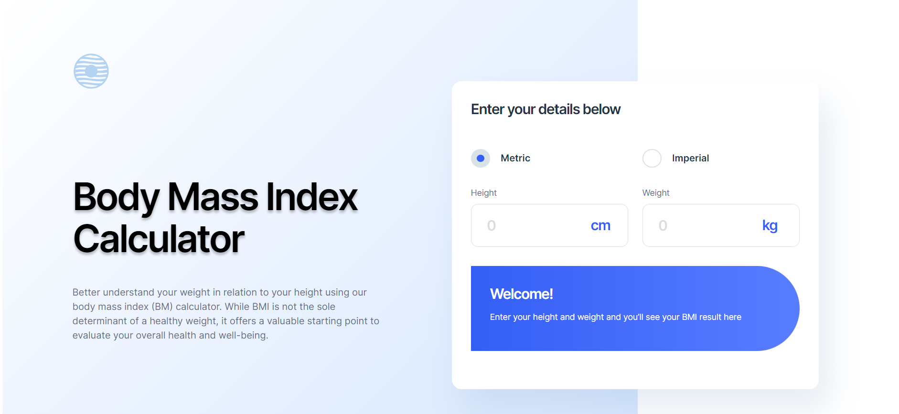
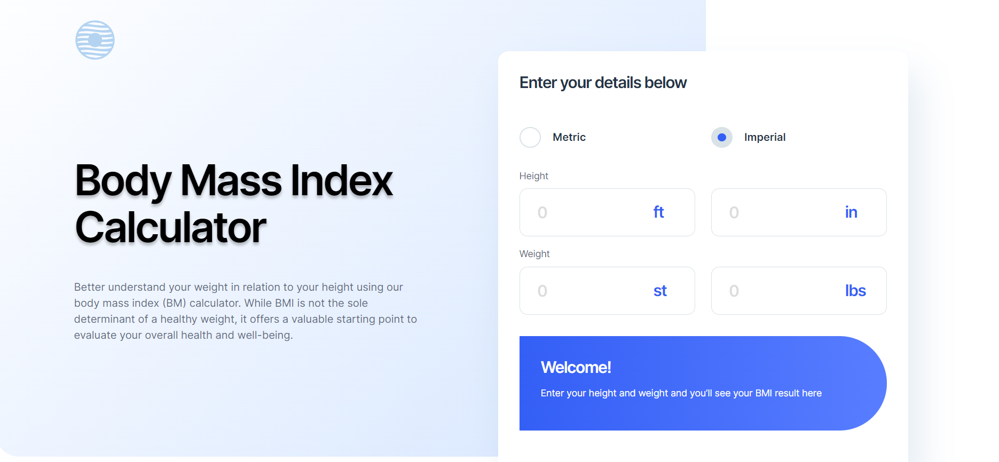
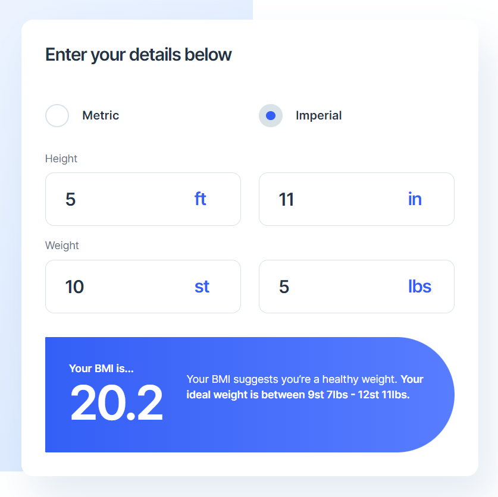

# Frontend Mentor - Body Mass Index Calculator solution

This is a solution to the [Body Mass Index Calculator challenge on Frontend Mentor](https://www.frontendmentor.io/challenges/body-mass-index-calculator-brrBkfSz1T). Frontend Mentor challenges help you improve your coding skills by building realistic projects. 

## Table of contents

- [Overview](#overview)
  - [The challenge](#the-challenge)
  - [Screenshot](#screenshot)
  - [Links](#links)
- [My process](#my-process)
  - [Built with](#built-with)
  - [What I learned](#what-i-learned)
  - [Continued development](#continued-development)
  - [Useful resources](#useful-resources)
- [Author](#author)
- [Acknowledgments](#acknowledgments)

**Note: Delete this note and update the table of contents based on what sections you keep.**

## Overview


### The challenge

Users should be able to:

- Select whether they want to use metric or imperial units
- Enter their height and weight
- See their BMI result, with their weight classification and healthy weight range
- View the optimal layout for the interface depending on their device's screen size
- See hover and focus states for all interactive elements on the page

### Screenshot









Add a screenshot of your solution. The easiest way to do this is to use Firefox to view your project, right-click the page and select "Take a Screenshot". You can choose either a full-height screenshot or a cropped one based on how long the page is. If it's very long, it might be best to crop it.

Alternatively, you can use a tool like [FireShot](https://getfireshot.com/) to take the screenshot. FireShot has a free option, so you don't need to purchase it. 

Then crop/optimize/edit your image however you like, add it to your project, and update the file path in the image above.

**Note: Delete this note and the paragraphs above when you add your screenshot. If you prefer not to add a screenshot, feel free to remove this entire section.**

### Links

- Solution URL: [BMI-Calculator](https://bmi-calculator-fidelis.netlify.app/)
- GitHub Repo: [Link to the GitHub Repo](https://github.com/fidelismensah/BMI-Calculator)

## My process

### Built with

- Semantic HTML5 markup
- CSS custom properties
- Flexbox
- CSS Grid
- [jQuery](https://reactjs.org/) - JS library
- [TypeScript](https://nextjs.org/) - JS Compiler
- [Styled Components](https://styled-components.com/) - For styles

**Note: These are just examples. Delete this note and replace the list above with your own choices**

### What I learned

Use this section to recap over some of your major learnings while working through this project. Writing these out and providing code samples of areas you want to highlight is a great way to reinforce your own knowledge.

To see how you can add code snippets, see below:

```html
<h1>Some HTML code I'm proud of</h1>
```
```css
/* Ways to remove the arrows in an input field*/
/* For WebKit-based browsers */
input[type="number"]::-webkit-inner-spin-button,
input[type="number"]::-webkit-outer-spin-button {
  -webkit-appearance: none;
  margin: 0;
}

/* For Mozilla Firefox */
input[type="number"]::-moz-number-spin-box {
  -moz-appearance: textfield;
}

```
```js
const updateBMI = () => {
  console.log('...🎉')
}
```


### Useful resources

- [jQuery](https://jquery.com/) - This helped me with the transition. I really liked how I was switching betweeen *Metric* and *Imperial* easily.
- [The TypeScript Handbook](https://www.typescriptlang.org/docs/handbook/intro.html) - This is an amazing article which helped me finally understand TypeScript. I'd recommend it to anyone still learning this concept. A reader who completes the walkthrough should be able to:
  - Read and understand commonly-used TypeScript syntax and patterns
  - Explain the effects of important compiler options
  - Correctly predict type system behavior in most cases


## Author

- Website - [Add your name here](https://www.your-site.com)
- Frontend Mentor - [@yourusername](https://www.frontendmentor.io/profile/yourusername)
- Twitter - [@yourusername](https://www.twitter.com/yourusername)

**Note: Delete this note and add/remove/edit lines above based on what links you'd like to share.**

## Acknowledgments

This is where you can give a hat tip to anyone who helped you out on this project. Perhaps you worked in a team or got some inspiration from someone else's solution. This is the perfect place to give them some credit.

**Note: Delete this note and edit this section's content as necessary. If you completed this challenge by yourself, feel free to delete this section entirely.**
